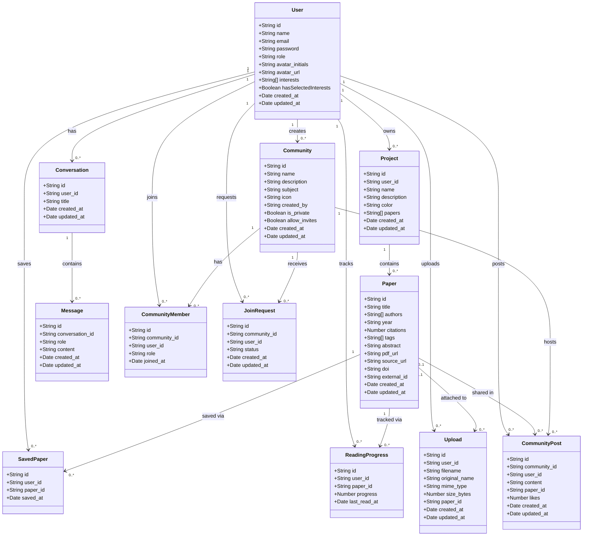
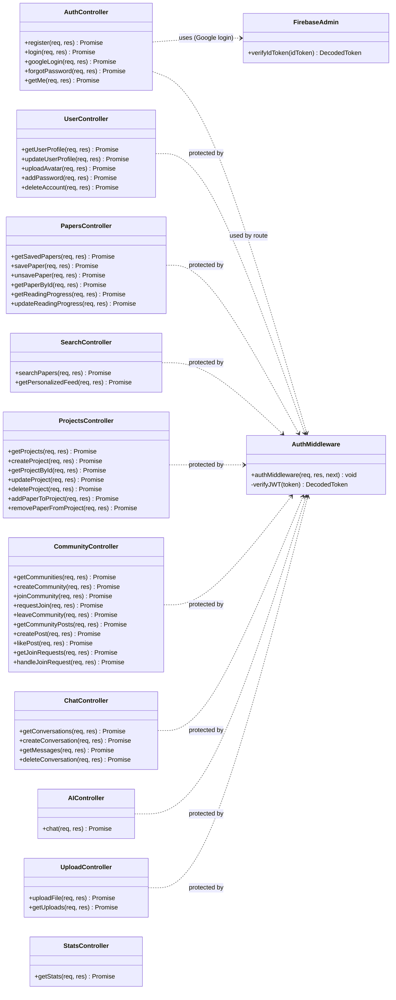
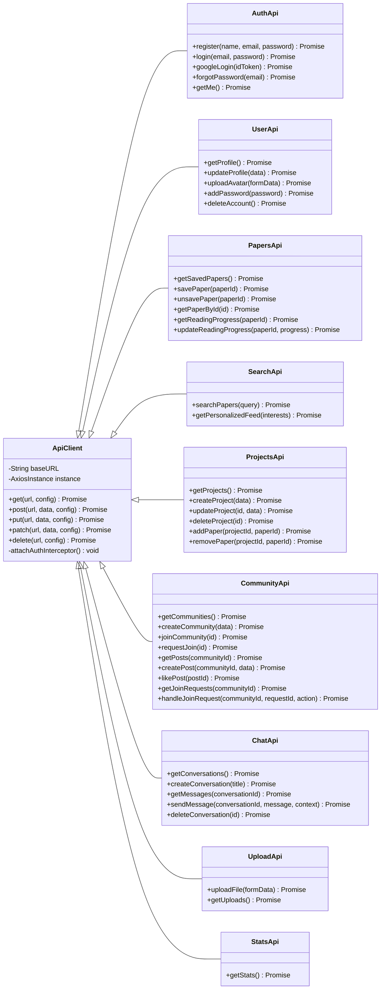

# Class Diagram — Research Hub

This diagram covers the full architecture: **MongoDB Models**, **Backend Controllers/Routes**, **Frontend Components**, and **Services**.

---

## Part 1 — Data Models (MongoDB / Mongoose)



---

## Part 2 — Backend Controllers & Routes



---

## Part 3 — Frontend Components

```mermaid
classDiagram
    direction TB

    class App {
        -String activeTab
        -Boolean isChatOpen
        -String selectedPaper
        -Boolean isAuthenticated
        -Object user
        +render() JSX
        -fetchUserProfile() void
        -handleLogin(token, user) void
    }

    class AuthScreen {
        -String mode
        -String email
        -String password
        -String name
        -Boolean loading
        -String error
        +handleEmailLogin() void
        +handleRegister() void
        +handleGoogleSignIn() void
        +render() JSX
    }

    class InterestsModal {
        -String[] selectedInterests
        -Boolean loading
        +handleToggleInterest(interest) void
        +handleSubmit() void
        +render() JSX
    }

    class LeftSidebar {
        -String activeTab
        +onTabChange(tab) void
        +render() JSX
    }

    class CenterFeed {
        -String activeTab
        -Paper[] savedPapers
        -Project[] projects
        -Boolean loading
        +onPaperSelect(id) void
        +render() JSX
    }

    class DiscoverView {
        -String query
        -Paper[] results
        -Boolean loading
        -String error
        +handleSearch() void
        +render() JSX
    }

    class ForYouView {
        -Paper[] papers
        -Boolean loading
        -String[] userInterests
        +fetchPersonalizedFeed() void
        +onGoToSettings() void
        +render() JSX
    }

    class ResearchPaperCard {
        -Paper paper
        -Boolean isSaved
        +onSelect(id) void
        +onSave(id) void
        +render() JSX
    }

    class PaperDetailModal {
        -String paperId
        -Paper paper
        -Number readingProgress
        -Boolean isSaved
        +onClose() void
        +handleSave() void
        +handleProgressUpdate() void
        +render() JSX
    }

    class AIChatSidebar {
        -Boolean isOpen
        -Conversation[] conversations
        -Message[] messages
        -String activeConversation
        -String inputText
        -Boolean loading
        +onClose() void
        +handleSendMessage() void
        +handleUploadPDF() void
        +handleNewConversation() void
        +handleDeleteConversation() void
        +render() JSX
    }

    class CommunityView {
        -Community[] communities
        -String activeView
        -String selectedCommunity
        -CommunityPost[] posts
        +onPaperSelect(id) void
        +handleJoin(id) void
        +handleCreatePost() void
        +handleLikePost(id) void
        +render() JSX
    }

    class ProjectDetailView {
        -Project project
        -Paper[] papers
        +onBack() void
        +handleRemovePaper(id) void
        +render() JSX
    }

    class CreateProjectModal {
        -String name
        -String description
        -String color
        -Boolean loading
        +onClose() void
        +handleSubmit() void
        +render() JSX
    }

    class SettingsView {
        -Object user
        -String theme
        -Boolean loading
        +handleUpdateProfile() void
        +handleChangePassword() void
        +handleDeleteAccount() void
        +handleToggleTheme() void
        +render() JSX
    }

    class BrandLogo {
        +render() JSX
    }

    %% ── Component Relationships ──────────────────────
    App "1" *-- "1" AuthScreen        : shows if not auth
    App "1" *-- "1" InterestsModal    : shows if no interests
    App "1" *-- "1" LeftSidebar       : always renders
    App "1" *-- "1" CenterFeed        : tab: library/projects
    App "1" *-- "1" DiscoverView      : tab: discover
    App "1" *-- "1" ForYouView        : tab: foryou
    App "1" *-- "1" CommunityView     : tab: community
    App "1" *-- "1" SettingsView      : tab: settings
    App "1" *-- "1" AIChatSidebar     : always rendered
    App "1" *-- "1" PaperDetailModal  : shown on paper click

    CenterFeed "1" *-- "0..*" ResearchPaperCard  : renders
    CenterFeed "1" *-- "0..*" ProjectDetailView  : renders
    CenterFeed "1" *-- "1"   CreateProjectModal  : renders

    DiscoverView "1" *-- "0..*" ResearchPaperCard : renders
    ForYouView "1" *-- "0..*" ResearchPaperCard   : renders
    CommunityView "1" *-- "0..*" ResearchPaperCard : renders

    LeftSidebar "1" ..> BrandLogo : renders
```

---

## Part 4 — API Services (Frontend ↔ Backend)


