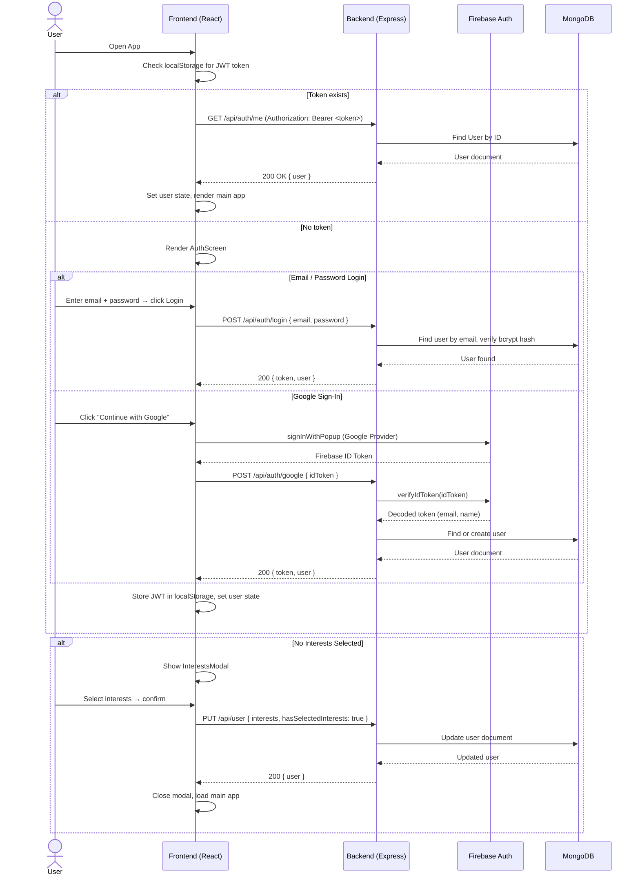
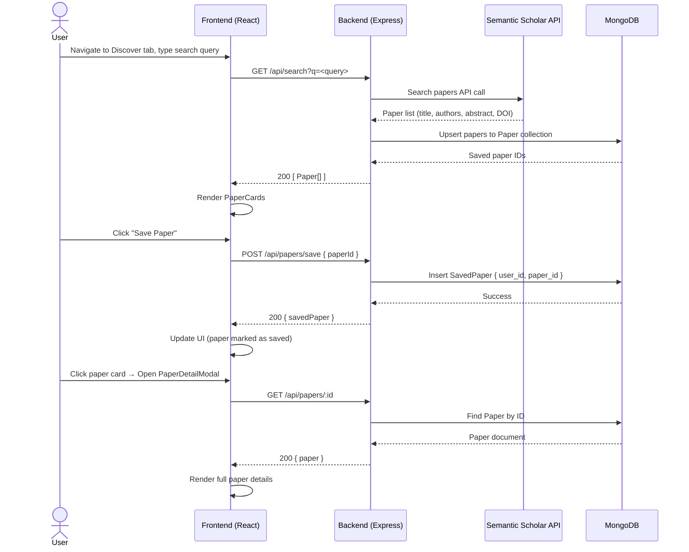
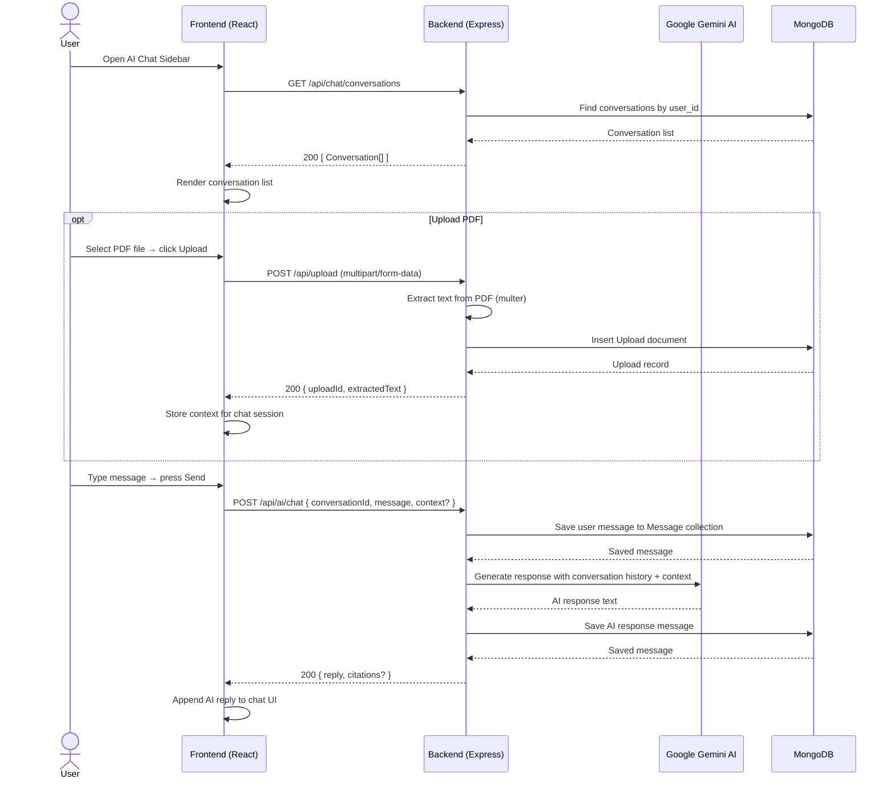
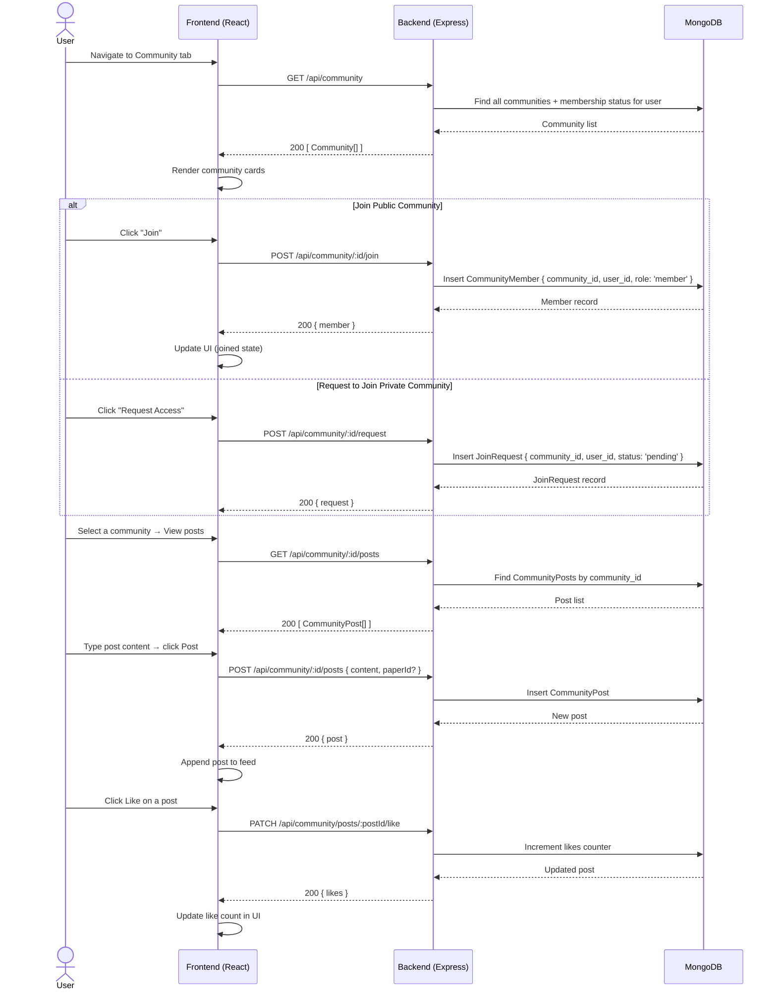

# Sequence Diagram — Research Hub

Key interaction flows between User (Browser), Frontend (React), Backend (Express), External Services, and Database (MongoDB).

---

## 1. User Authentication Flow

---

## 2. Paper Search & Save Flow

---

## 3. AI Chat Flow (with PDF Upload)

---

## 4. Community Interaction Flow

