# Use Case Diagram — Research Hub

This diagram shows all actors and their interactions with the system use cases.

```mermaid
flowchart LR
    %% ── Actors ──────────────────────────────────────────────────────────────
    Guest(["👤 Guest\n(Unauthenticated User)"])
    AuthUser(["👥 Authenticated User"])
    Admin(["🔑 Community Admin"])
    GeminiAI(["🤖 Google Gemini\n(External AI)"])
    SemanticScholar(["📚 Semantic Scholar\n(External API)"])
    Firebase(["🔥 Firebase Auth\n(Google OAuth)"])

    %% ── System Boundary ──────────────────────────────────────────────────────
    subgraph System["🔬 Research Hub System"]

        subgraph Auth["Authentication"]
            UC1["Register with Email"]
            UC2["Login with Email/Password"]
            UC3["Login with Google OAuth"]
            UC4["Forgot Password"]
            UC5["View / Update Profile"]
            UC6["Change Password"]
            UC7["Delete Account"]
            UC8["Select Research Interests"]
        end

        subgraph Papers["Paper Discovery"]
            UC9["Search Research Papers"]
            UC10["View Paper Details"]
            UC11["Save Paper to Library"]
            UC12["View Personalized Feed"]
            UC13["View Saved Papers"]
            UC14["Upload PDF for Reading"]
        end

        subgraph Projects["Project Management"]
            UC15["Create Research Project"]
            UC16["Add Papers to Project"]
            UC17["View Project Details"]
            UC18["Delete Project"]
        end

        subgraph Community["Community"]
            UC19["Browse Communities"]
            UC20["Join Public Community"]
            UC21["Request to Join Private Community"]
            UC22["Create Community"]
            UC23["View Community Posts"]
            UC24["Create Post in Community"]
            UC25["Like a Post"]
            UC26["Manage Join Requests"]
            UC27["Upload Avatar"]
        end

        subgraph AIChat["AI Chat"]
            UC28["Start AI Conversation"]
            UC29["Send Message to AI"]
            UC30["Upload PDF for AI Context"]
            UC31["View Chat History"]
            UC32["Clear Conversation"]
        end

        subgraph Stats["Platform Stats"]
            UC33["View Platform Statistics"]
        end
    end

    %% ── Guest ────────────────────────────────────────────────────────────────
    Guest --- UC1
    Guest --- UC2
    Guest --- UC3
    Guest --- UC4

    %% ── Authenticated User ───────────────────────────────────────────────────
    AuthUser --- UC5
    AuthUser --- UC6
    AuthUser --- UC7
    AuthUser --- UC8
    AuthUser --- UC9
    AuthUser --- UC10
    AuthUser --- UC11
    AuthUser --- UC12
    AuthUser --- UC13
    AuthUser --- UC14
    AuthUser --- UC15
    AuthUser --- UC16
    AuthUser --- UC17
    AuthUser --- UC18
    AuthUser --- UC19
    AuthUser --- UC20
    AuthUser --- UC21
    AuthUser --- UC22
    AuthUser --- UC23
    AuthUser --- UC24
    AuthUser --- UC25
    AuthUser --- UC27
    AuthUser --- UC28
    AuthUser --- UC29
    AuthUser --- UC30
    AuthUser --- UC31
    AuthUser --- UC32
    AuthUser --- UC33

    %% ── Admin ────────────────────────────────────────────────────────────────
    Admin --- UC26

    %% ── External Services ────────────────────────────────────────────────────
    UC3 --- Firebase
    UC9 --- SemanticScholar
    UC12 --- SemanticScholar
    UC29 --- GeminiAI

    %% ── Styles ───────────────────────────────────────────────────────────────
    classDef actor fill:#1e293b,stroke:#6366f1,color:#e2e8f0,rx:8
    classDef usecase fill:#0f172a,stroke:#818cf8,color:#c7d2fe,rx:12
    classDef external fill:#172554,stroke:#38bdf8,color:#bae6fd,rx:8
    class Guest,AuthUser,Admin actor
    class GeminiAI,SemanticScholar,Firebase external
    class UC1,UC2,UC3,UC4,UC5,UC6,UC7,UC8,UC9,UC10,UC11,UC12,UC13,UC14,UC15,UC16,UC17,UC18,UC19,UC20,UC21,UC22,UC23,UC24,UC25,UC26,UC27,UC28,UC29,UC30,UC31,UC32,UC33 usecase
```

---

## Use Case Descriptions

| ID | Use Case | Actor | Description |
|----|----------|-------|-------------|
| UC1 | Register with Email | Guest | Create a new account with name, email, and password |
| UC2 | Login with Email/Password | Guest | Authenticate using stored credentials |
| UC3 | Login with Google OAuth | Guest | Sign in using Google via Firebase |
| UC4 | Forgot Password | Guest | Receive password reset email |
| UC5 | View / Update Profile | User | Update display name and avatar |
| UC6 | Change Password | User | Update account password |
| UC7 | Delete Account | User | Permanently remove account and associated data |
| UC8 | Select Research Interests | User | Choose topics for personalized recommendations |
| UC9 | Search Research Papers | User | Query Semantic Scholar for papers by keyword |
| UC10 | View Paper Details | User | See full metadata, abstract, PDF link |
| UC11 | Save Paper to Library | User | Bookmark a paper to personal library |
| UC12 | View Personalized Feed | User | See AI-curated papers based on interests |
| UC13 | View Saved Papers | User | Browse all previously bookmarked papers |
| UC14 | Upload PDF for Reading | User | Upload a local PDF to the platform |
| UC15 | Create Research Project | User | Group related papers under a named project |
| UC16 | Add Papers to Project | User | Attach saved papers to an existing project |
| UC17 | View Project Details | User | See all papers in a project |
| UC18 | Delete Project | User | Remove a project (papers remain in library) |
| UC19 | Browse Communities | User | Discover public and private communities |
| UC20 | Join Public Community | User | Instantly join an open community |
| UC21 | Request to Join Private Community | User | Send a membership request to a private group |
| UC22 | Create Community | User | Start a new research community |
| UC23 | View Community Posts | User | Read posts and discussions in a community |
| UC24 | Create Post in Community | User | Share insights or papers in a community |
| UC25 | Like a Post | User | Express appreciation for a community post |
| UC26 | Manage Join Requests | Admin | Accept or reject pending join requests |
| UC27 | Upload Avatar | User | Set a profile picture |
| UC28 | Start AI Conversation | User | Create a new chat session with the AI assistant |
| UC29 | Send Message to AI | User | Chat with Gemini AI for research help |
| UC30 | Upload PDF for AI Context | User | Provide PDF to AI for context-aware responses |
| UC31 | View Chat History | User | Review previous AI conversations |
| UC32 | Clear Conversation | User | Delete all messages in a chat session |
| UC33 | View Platform Statistics | User | See aggregated platform usage stats |
