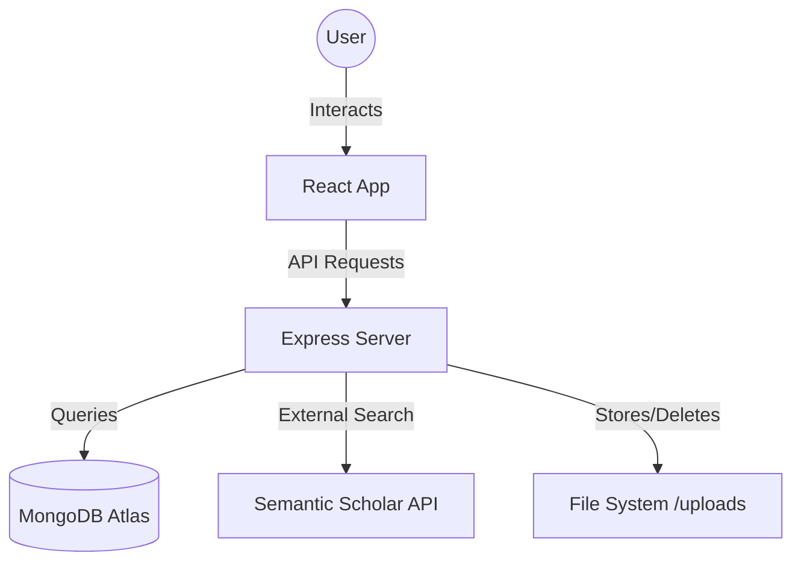
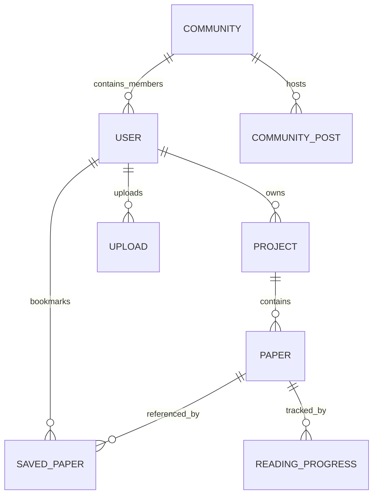

# Abstracts: AI-Powered Research Discovery 🚀

Abstracts is a comprehensive web application designed for students and researchers to discover, organize, and discuss academic papers. It leverages AI-augmented workflows to streamline research activities.

---

## 🛠 Technology Stack

### Frontend
- **React 18**: Core UI library.
- **Vite**: Ultra-fast build tool and dev server.
- **Tailwind CSS**: Utility-first styling with modern aesthetics.
- **Lucide React**: Clean and consistent iconography.
- **Framer Motion**: Smooth animations and micro-interactions.
- **Radix UI**: Primitive components for accessible UI elements (Progress, Badge, etc.).

### Backend
- **Node.js & Express**: High-performance server environment.
- **MongoDB Atlas**: Scalable NoSQL database for flexible data modeling.
- **Mongoose**: Elegant object modeling for Node.js.
- **JWT & BcryptJS**: Secure authentication and password hashing.
- **Multer**: Handling multipart form data for PDF uploads.

---

## 📐 Project Architecture

### System Workflow


### Database Schema
The database is structured around the core entities of the research workflow:



---

## ✨ Core Features

### 1. Paper Discovery
Users can search millions of papers via the **Semantic Scholar API** integration. Papers can be previewed, saved to the library, or imported directly into the local database.

### 2. Research Library & Projects
- **Library**: Centralized view of all imported and saved papers.
- **Projects**: Specialized workspaces to group papers by topic (e.g., "Deep Learning", "Bioinformatics").
- **Reading Progress**: Track exactly how much of a paper has been read.

### 3. AI Chat Assistant
A persistent sidebar allows users to chat with an AI assistant for summarizing abstracts, explaining complex concepts, or generating citations.

### 4. Community Collaboration
Discussion forums (Communities) divided by research subjects where users can post insights and attach papers for peer review.

---

## 💻 Important Code Implementation

### Standardized API Communication
The frontend uses a centralized `request` wrapper in `src/app/services/api.ts` to handle authentication headers and error management consistently.

```typescript
async function request<T>(endpoint: string, options: RequestInit = {}): Promise<ApiResponse<T>> {
  const token = localStorage.getItem('token');
  const config = {
    headers: {
      'Content-Type': 'application/json',
      'Authorization': token ? `Bearer ${token}` : '',
      ...options.headers,
    },
    ...options,
  };
  const response = await fetch(`${BASE_URL}${endpoint}`, config);
  return await response.json();
}
```

### Permanent Deletion & Storage Cleanup
A critical feature is the ability to delete papers and automatically clear physical storage.

```javascript
// server/controllers/papersController.js
export const deletePaper = async (req, res) => {
  const existing = await Paper.findById(req.params.id);
  
  // Clean up physical storage
  const uploads = await Upload.find({ paper_id: existing._id });
  for (const upload of uploads) {
    const filePath = path.join(__dirname, '..', 'uploads', upload.filename);
    if (fs.existsSync(filePath)) fs.unlinkSync(filePath);
    await Upload.deleteOne({ _id: upload._id });
  }

  // Remove DB records
  await Paper.deleteOne({ _id: existing._id });
  await SavedPaper.deleteMany({ paper_id: existing._id });
};
```

---

## 🎨 Design Philosophy

Abstracts follows a **Premium Modern SaaS** aesthetic:
- **Clean Interface**: Minimal usage of borders, prioritizing white space and soft shadows.
- **Dynamic Icons**: Using `lucide-react` for a lightweight, recognizable visual language.
- **Glassmorphism**: Subtle backdrop blurs on modals and sidebars for depth.
- **High Contrast Typography**: Using Inter or similar sans-serif fonts for maximum readability of technical abstracts.
- **Micro-animations**: Smooth hover transitions and loading states to keep the app feeling alive.

---

## 🚀 Deployment

The project is configured for **Vercel** (`vercel.json`), utilizing serverless functions for the API and static hosting for the React frontend.

1. **Frontend**: Bundled via Vite.
2. **Backend**: Express routes adapted as Vercel serverless endpoints.
3. **Environment**: Managed through standard `.env` variables for MongoDB connection strings and JWT secrets.
