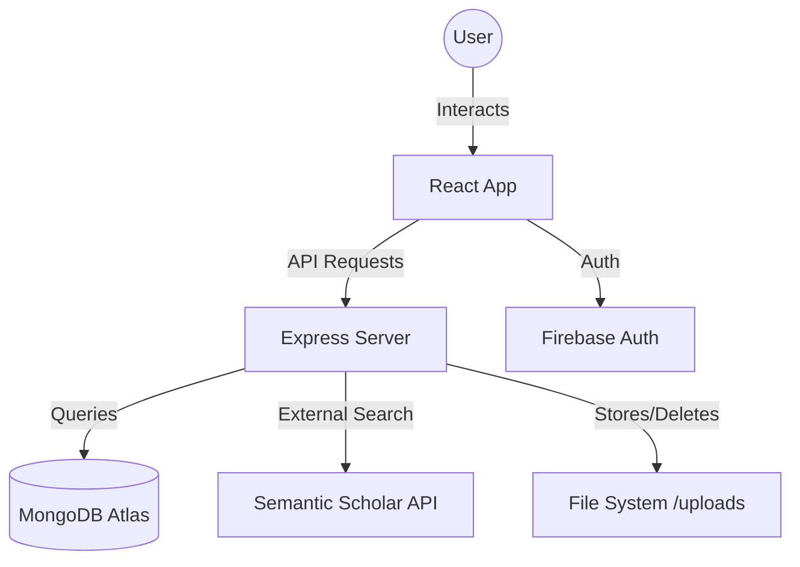
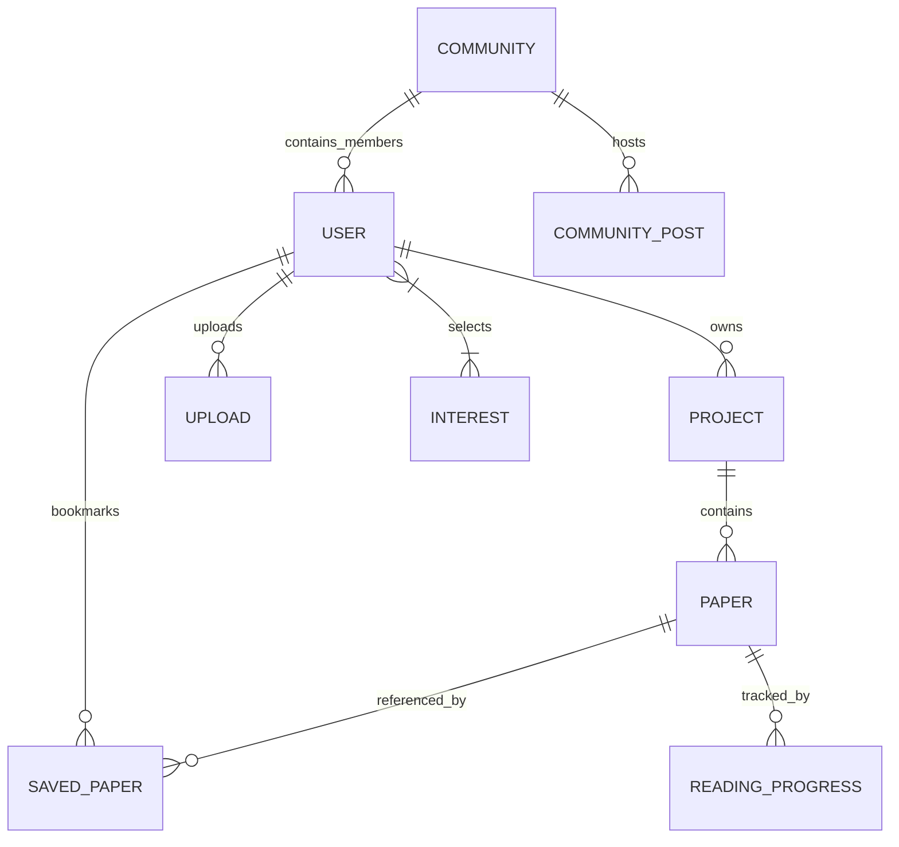

# Abstracts: AI-Powered Research Discovery 🚀

Abstracts is a comprehensive web application designed for students and researchers to discover, organize, and discuss academic papers. It leverages AI-augmented workflows and personalized feeds to streamline every stage of research.

---

## 🛠 Technology Stack

### Frontend
- **React 18**: Core UI library with hooks-based state management.
- **Vite**: Ultra-fast build tool and dev server.
- **Tailwind CSS**: Utility-first styling with modern aesthetics.
- **Lucide React**: Clean and consistent iconography.
- **Framer Motion**: Smooth animations and micro-interactions.
- **Radix UI**: Primitive components for accessible UI elements (Progress, Badge, etc.).

### Backend
- **Node.js & Express**: High-performance server environment.
- **MongoDB Atlas**: Scalable NoSQL database for flexible data modeling.
- **Mongoose**: Elegant object modeling for Node.js.
- **JWT & BcryptJS**: Secure authentication and password hashing.
- **Multer**: Handling multipart form data for file uploads.
- **Firebase Admin SDK**: Google Sign-In authentication integration.

---

## 📐 Project Architecture

### System Workflow


### Database Schema
The database is structured around the core entities of the research workflow:



### User Schema (updated)
```javascript
// server/models/index.js
const UserSchema = new mongoose.Schema({
  name:                 String,
  email:                { type: String, unique: true },
  passwordHash:         String,
  role:                 String,
  interests:            [String],        // up to 4 selected research domains
  hasSelectedInterests: { type: Boolean, default: false },
  // ...stats, avatar, etc.
});
```

---

## ✨ Core Features

### 1. Paper Discovery
Users can search millions of papers via the **Semantic Scholar API** integration. Papers can be previewed, saved to the library, or imported directly into the local database.

### 2. Research Library & Projects
- **Library**: Centralized view of all imported and saved papers with sort/search.
- **Projects**: Specialized workspaces to group papers by topic (e.g., "Deep Learning", "Bioinformatics").
- **Reading Progress**: Track exactly how much of a paper has been read.

### 3. 🗞 For You — Personalized Feed
A dedicated **"For You"** page that automatically fetches the latest papers for each of the user's selected research interests:
- Horizontally scrollable card rows, one per interest domain.
- Papers fetched in parallel from Semantic Scholar on page mount.
- **Import** button to save directly to personal library; **Open** button to read the source.
- "See all →" button navigates to Discover with the interest pre-filled.
- **Refresh** re-fetches all feeds on demand.
- Empty state guides new users to set interests via Settings.

### 4. 🔬 Research Interests Onboarding
New users are prompted with an **Interests Selection Modal** on first login:
- **71 research domains** spanning Tech, Biology, Medicine, Environment, Social Sciences, Economics, Humanities.
- Each domain has a **contextual Unsplash image** background.
- **Max 4 selections** enforced — visual warning when limit is reached.
- **Custom domain input** — if a user's field isn't listed, they can add it manually.
- Interests are saved to the user profile and used to drive the For You feed.
- Accessible from **Settings → Research Interests** to update at any time.

### 5. AI Chat Assistant
A persistent sidebar allows users to chat with an AI assistant for summarizing abstracts, explaining complex concepts, or generating citations.

### 6. Community Collaboration
Discussion forums (Communities) divided by research subjects where users can post insights and attach papers for peer review.

---

## 🧭 Navigation

| Tab | Icon | Description |
|---|---|---|
| Library | 📚 BookOpen | All imported/saved papers |
| Projects | 📁 FolderOpen | Grouped research workspaces |
| Saved Papers | 🔖 BookmarkCheck | User's personal bookmarks |
| **For You** | 📰 Newspaper | **Personalized interest-based paper feed** |
| Discover | 🌐 Globe | Search Semantic Scholar |
| Community | 👥 Users | Discussion forums |
| Settings | ⚙️ Settings | Profile, interests, theme |

---

## 💻 Important Code Implementation

### Standardized API Communication
The frontend uses a centralized `request` wrapper in `src/app/services/api.ts` to handle authentication headers and error management consistently.

```typescript
async function request<T>(endpoint: string, options: RequestInit = {}): Promise<ApiResponse<T>> {
  const token = localStorage.getItem('token');
  const config = {
    headers: {
      'Content-Type': 'application/json',
      'Authorization': token ? `Bearer ${token}` : '',
      ...options.headers,
    },
    ...options,
  };
  const response = await fetch(`${BASE_URL}${endpoint}`, config);
  return await response.json();
}
```

### Interests Onboarding — Saving to Profile
```typescript
// src/app/components/InterestsModal.tsx
const handleSave = async () => {
  await userApi.updateProfile({
    interests: selected,
    hasSelectedInterests: true,
  });
  onComplete(selected);
};
```

### For You — Parallel Fetch per Interest
```typescript
// src/app/components/ForYouView.tsx
userInterests.forEach(async (interest, idx) => {
  const res = await searchApi.searchPapers(interest, 6, 0);
  setFeeds(prev => prev.map((f, i) =>
    i === idx ? { ...f, papers: res.data, loading: false } : f
  ));
});
```

### Keep-Alive Tab Architecture
`ForYouView` and `DiscoverView` are always mounted in the DOM — just toggled with CSS — so search state is never lost when switching tabs:

```tsx
// src/app/App.tsx
<div className={`flex-1 overflow-hidden ${activeTab === 'foryou' ? 'flex' : 'hidden'}`}>
  <ForYouView userInterests={user?.interests || []} onGoToSettings={...} />
</div>
<div className={`flex-1 overflow-hidden ${activeTab === 'discover' ? 'flex' : 'hidden'}`}>
  <DiscoverView />
</div>
```

### Permanent Deletion & Storage Cleanup
```javascript
// server/controllers/papersController.js
export const deletePaper = async (req, res) => {
  const existing = await Paper.findById(req.params.id);

  const uploads = await Upload.find({ paper_id: existing._id });
  for (const upload of uploads) {
    const filePath = path.join(__dirname, '..', 'uploads', upload.filename);
    if (fs.existsSync(filePath)) fs.unlinkSync(filePath);
    await Upload.deleteOne({ _id: upload._id });
  }

  await Paper.deleteOne({ _id: existing._id });
  await SavedPaper.deleteMany({ paper_id: existing._id });
};
```

---

## 🎨 Design Philosophy

Abstracts follows a **Premium Modern SaaS** aesthetic:
- **Clean Interface**: Minimal usage of borders, prioritizing white space and soft shadows.
- **Dynamic Icons**: Using `lucide-react` for a lightweight, recognizable visual language.
- **Glassmorphism**: Subtle backdrop blurs on modals and sidebars for depth.
- **High Contrast Typography**: Using Inter or similar sans-serif fonts for maximum readability of technical abstracts.
- **Micro-animations**: Smooth hover transitions and loading states to keep the app feeling alive.
- **Skeleton Loaders**: Shaped placeholder cards using `bg-muted animate-pulse` visible in both light and dark mode.

---

## 🚀 Deployment

The project is configured for **Vercel** (`vercel.json`), utilizing serverless functions for the API and static hosting for the React frontend.

1. **Frontend**: Bundled via Vite (`npm run build`).
2. **Backend**: Express routes adapted as Vercel serverless endpoints.
3. **Environment**: Managed through standard `.env` variables:
   - `MONGODB_URI` — MongoDB Atlas connection string
   - `JWT_SECRET` — Token signing key
   - `FIREBASE_*` — Firebase Admin SDK credentials (for Google Sign-In)

---

## 📁 Key File Reference

| File | Purpose |
|---|---|
| `src/app/App.tsx` | Root — routing, auth state, keep-alive tab layout |
| `src/app/components/InterestsModal.tsx` | Onboarding modal — 71 domains, image cards, custom input |
| `src/app/components/ForYouView.tsx` | Personalized paper feed by interest |
| `src/app/components/DiscoverView.tsx` | Semantic Scholar search UI |
| `src/app/components/SettingsView.tsx` | Profile settings + interests editor |
| `src/app/components/LeftSidebar.tsx` | Navigation sidebar |
| `src/app/services/api.ts` | Centralized API client + TypeScript types |
| `server/models/index.js` | Mongoose schemas (User, Paper, Project, Community…) |
| `server/controllers/userController.js` | User profile CRUD including interests |
| `server/controllers/papersController.js` | Paper CRUD + physical file cleanup |
